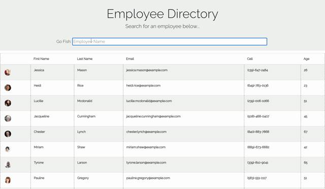

# Project Title 
### **React Employee Directory**

## Description
A React app which lets a user quickly access profiles from a directory -- great for employers looking to swiftly filter through their employee roster.

## Visuals

### Table of Contents
* [Installation](#Installation)
* [Usage](#Usage)
* [License](#License)
* [Contributing](#Contributing)
* [Questions](#Questions)

## Installation
Run 'npm install package.json', then 'npm start' in the command line.

## Usage
This app can be used to sift through a roster of user profiles, instantaneously.

## License
MIT License selected. Click the badge above for further details.

## Contributing
Pull requests are welcome. For major changes, please open an issue first to discuss what you would like to change. Please make sure to update any tests where appropriate.

## Questions

Please reach out to the repo owner with any questions you may have.

- - -
© 2020 Rocco Losito. All Rights Reserved.